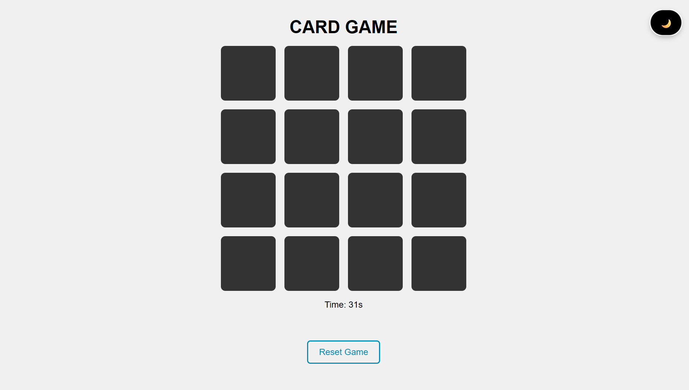
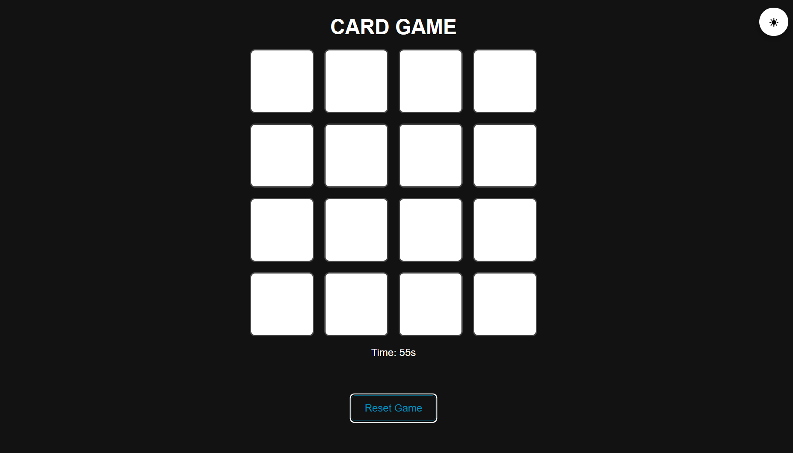
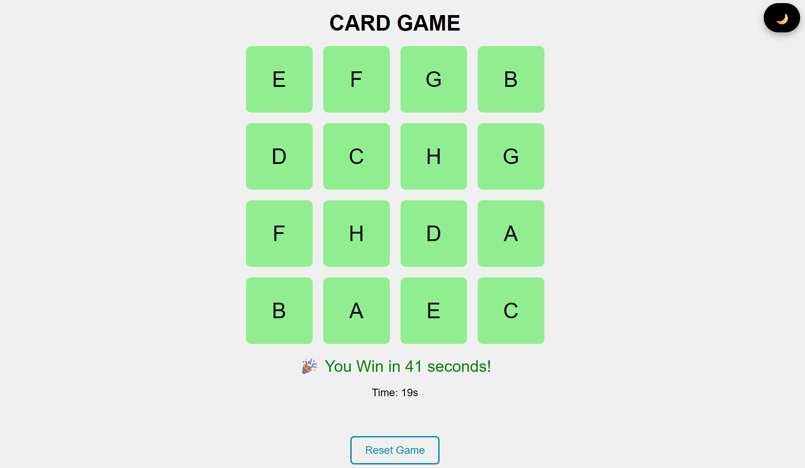

# 🎴 Memory Card Game

Welcome to my **Memory Card Game** — a fun browser-based challenge built with **HTML**, **CSS**, and **JavaScript**!

---

## 🧠 How to Play

- You start with a shuffled board of 16 cards (8 pairs).
- Click any two cards to flip and reveal them.
- If they match, they well show green .
- If they don’t, they flip back after a short delay and they well show red.
- Your goal is to match all pairs **before the timer runs out**!

---

## ⚙️ Features

- ✅ Card flip logic and animations
- ✅ Countdown timer (starts at 60 seconds)
- ✅ Match & mismatch detection
- ✅ Win message with your time
- ✅ Reset game button
- ✅ Dark mode toggle 🌙 / ☀
- ✅ Sound effects for game actions

---

## 📸 Screenshots

### 🎮 Game Board

### 🌑 Dark Mode

### 🎉 Win Message

